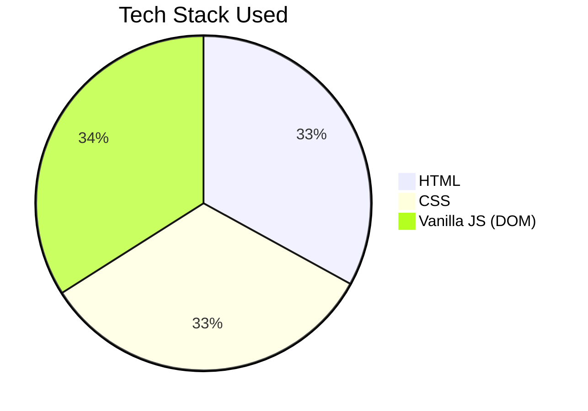

# 🎮 Mini JS Games

This is a small collection of beginner JavaScript games created using **HTML**, **CSS**, and **Vanilla JavaScript** with DOM manipulation.

---

## 🕹️ Games Included

### 1. 🐷 Pig Game

A two-player dice game. Players take turns rolling a die:

- If they roll a 1, they lose their turn and points.
- They can hold to secure their score and pass the turn.
- First to reach the winning score wins!

### 2. ❓ Guess The Number

A classic number guessing game:

- You try to guess a secret number between 1 and 20.
- Feedback is given based on your input.
- Tracks score and high score.

---

## 📊 Tech Stack Breakdown

